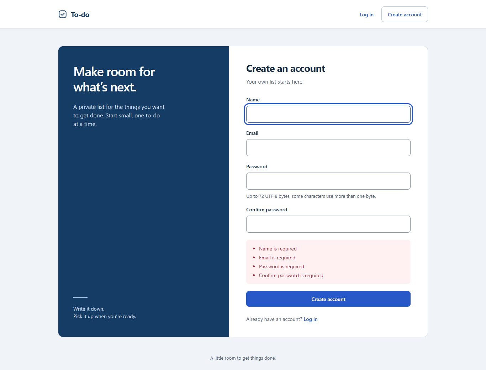
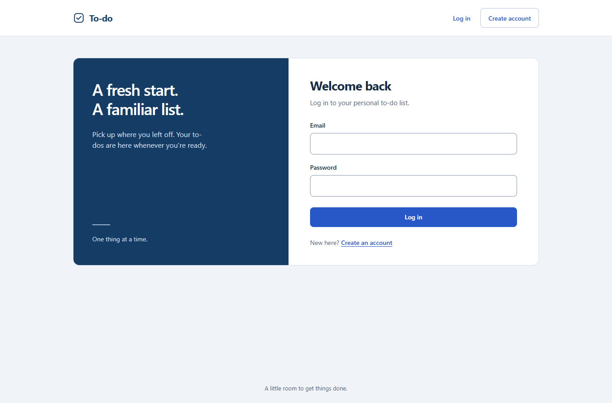
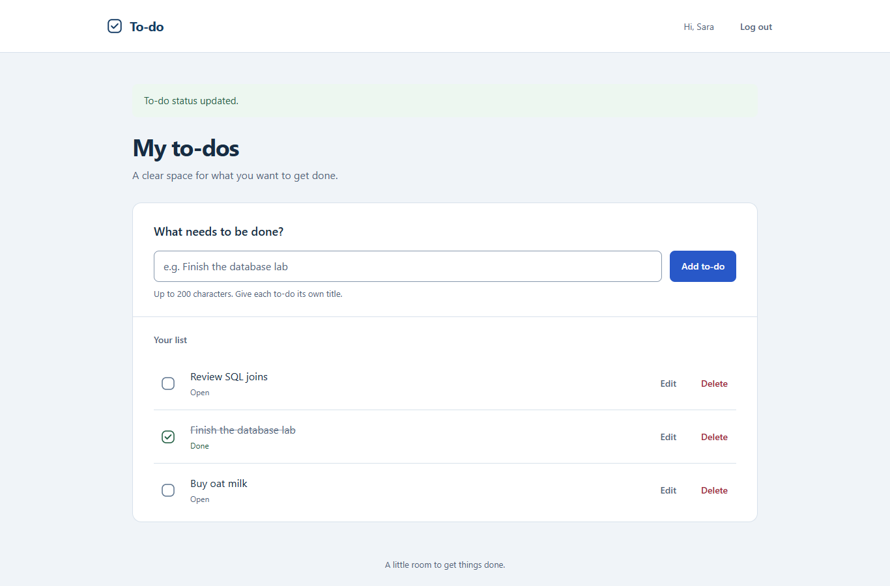
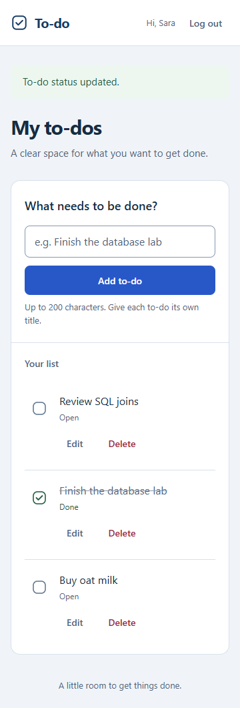

# Database Lab 2: Login and To-Do Application

A Flask/MySQL team assignment for Introduction to Database Systems at Alexandria National University. Register, log in, and manage a private personal to-do list.

Updated 8 October 2026. Published history currently ends at `6ffea51`; the completion work described here is local and awaits review, commit and push.

## Team and contributions

| Member | ID | Responsibility |
| --- | --- | --- |
| Moustafa Mohamed | 2304252 | Accounts/authentication, initial setup and shared integration |
| Ibrahim Hossam | 2304248 | Original personal to-do routes, template, JavaScript and oversized-ID handling |

The completion changes add shared styling, routing repair, duplicate-title handling, friendly error pages, testing and documentation. Codex assisted with these changes; both members must review and be able to explain the whole application. Both members already have commits in the repository. Coordinate shared-file editing through [HANDOFF.md](docs/HANDOFF.md); see [COMMIT_PLAN.md](docs/COMMIT_PLAN.md) before publishing.

## Technology and features

Python 3.14.4 was used for verification. The backend uses Flask, PyMySQL and plain parameterized SQL, bcrypt, Flask-Session/cachelib and python-dotenv. The frontend uses Jinja HTML, shared CSS and plain JavaScript. MySQL 8.4.11 was used for live checks. There is no ORM or frontend build step. Python packages are pinned in `requirements.txt`.

| Requirement | Implemented behavior |
| --- | --- |
| R1 | Register with name, email, password and confirmation; duplicate email displays `Email Already Exists`; successful registration opens the private list. |
| R2 | Login, generic `Invalid email or password` for unknown emails/wrong passwords, and POST logout. |
| R3 | Visitors go to login; each user sees only their own tasks, newest first. Both blueprints are registered; authenticated `/` redirects to `/todos`. |
| R4–R7 | Add, edit, mark done/open and delete. Deletion has browser confirmation with JavaScript, or an inline confirmation page without JavaScript. |
| R8 | Browser and server validation with the assignment's exact messages. Names/email/title limits count Unicode code points; bcrypt passwords are limited to 72 UTF-8 bytes. Invalid submissions do not write data. |
| R9 | Salted bcrypt hashes, parameterized queries, identity from the server-side session, user-scoped writes, session rotation and CSRF tokens on all write forms. |
| R10 | Shared study-folio styling, desktop/mobile layouts, visible done/open and empty states, feedback, signed-in name/logout, and friendly CSRF/404/405/500 pages. |

Additional requested behavior: duplicate task titles are prevented within one user's list by `UNIQUE(user_id, title)`. Titles are trimmed before saving. Comparison follows the database column's collation; the fresh schema uses a case-insensitive collation, so `Buy milk` and `buy milk` conflict. Done tasks still reserve their titles. Another user may use the same title, and saving an unchanged title is allowed.

Email input has native browser format checking; the app does not verify inbox ownership. This is a local single-process lab app: restarting Flask clears its in-memory sessions. It is not a production hosting setup.

## Setup from a new machine: Windows / PowerShell

### 1. Install prerequisites and get the code

Install Python, MySQL Server and Git. DBeaver Community provides a database editor; VS Code is optional. Start MySQL Server and obtain a local MySQL username/password. DBeaver is a client, so installing it alone does not provide a database server.

After these local completion changes are published, a fresh checkout can use:

```powershell
git clone https://github.com/moustafa-ash/-To-Do-Application.git
cd .\-To-Do-Application
```

Until they are published, run this updated working copy. Keep an existing configured `.env` and your local data.

### 2. Create an environment and install dependencies

```powershell
python -m venv .venv
.\.venv\Scripts\python.exe -m pip install -r requirements.txt
```

Use an existing `.venv` if you already have one. Activation is optional because the commands name its executable directly.

### 3. Build the database in DBeaver

**The full `database/schema.sql` deletes and recreates `registration`, including all its accounts and tasks. Run it only for initial setup or an intentional reset. Existing installations should use the migration below instead.**

1. Connect DBeaver to your MySQL server, normally `localhost:3306`.
2. Use **File → Open File** (Ctrl+O) to open `database/schema.sql`.
3. Assign the `localhost` connection to the editor if its tab says `<none>`; look under **SQL Editor → Context** for the connection option.
4. Clear any text selection and choose **SQL Editor → Execute SQL script**. Ctrl+Enter typically executes only the current statement.
5. Confirm all statements succeeded. In a separate SQL editor, inspect:

```sql
SHOW TABLES FROM registration;
DESCRIBE registration.users;
DESCRIBE registration.todos;
SHOW CREATE TABLE registration.todos;
```

Expect `users` and `todos`, the foreign key `todos.user_id → users.user_id` with default actions, and the `uq_todos_user_title` unique key. The script contains DDL only; there are no seed accounts or passwords.

### Existing database: enable duplicate-title protection without resetting

This machine's existing database has already received this migration without deleting rows. On another existing installation, first inspect duplicate groups:

```sql
SELECT user_id, title, COUNT(*) AS copies
FROM registration.todos
GROUP BY user_id, title
HAVING COUNT(*) > 1;
SHOW INDEX FROM registration.todos;
```

If there are duplicates, review and rename them before adding the constraint; do not silently delete them. If `uq_todos_user_title` is absent and the duplicate query is empty, run `database/migrations/001_unique_todo_titles.sql` once. Fresh schema installations already contain the constraint and must skip this migration.

### 4. Configure `.env`

If you do not already have `.env`:

```powershell
Copy-Item .env.example .env
```

Edit it locally with your own values:

```dotenv
DB_HOST=localhost
DB_PORT=3306
DB_USER=your_mysql_username
DB_PASSWORD=your_mysql_password
DB_NAME=registration
SECRET_KEY=your_generated_secret_key
```

Generate the secret value:

```powershell
.\.venv\Scripts\python.exe -c "import secrets; print(secrets.token_hex(32))"
```

Never commit or share `.env`. `.env.example` contains placeholders. Each teammate uses their own configuration. Restart Flask after changing it.

### 5. Check the connection and start Flask

```powershell
.\.venv\Scripts\python.exe -c "from db import get_connection; connection = get_connection(); print('Database helper works'); connection.close()"
.\.venv\Scripts\python.exe -m flask --app app run
```

Open [registration](http://127.0.0.1:5000/register) or [login](http://127.0.0.1:5000/login). Successful authentication opens `/todos`. The signed-in header provides logout. Keep the terminal running; Ctrl+C stops the server. This command does not auto-reload Python edits, so restart after changing code.

If connection fails, check the running server, local credentials and database name. Redact secrets before sharing errors. Forms may become stale after logout/login or server restart; reopen them when the recovery page asks you to.

## Repeatable verification

The automated database checks create a uniquely named `registration_verify_*` database and remove it afterward. They never reset the configured `registration` database. The MySQL account must be allowed to create/drop disposable databases. If a test process is forcibly terminated, inspect any leftover `registration_verify_*` database before removing it.

```powershell
.\.venv\Scripts\python.exe -X utf8 -B tests/integration.py
node tests/auth_validation.test.js
node tests/todos_validation.test.js
```

Node is only needed for JavaScript tests, not to run Flask. The two small Node checks use no npm dependencies.

Optional real-browser checks require Node, installed Google Chrome and Playwright. Install the test dependency outside the repository:

```powershell
npm install --prefix "$env:TEMP\todo-browser-checks" --no-package-lock playwright
$env:NODE_PATH = "$env:TEMP\todo-browser-checks\node_modules"
.\.venv\Scripts\python.exe -X utf8 -B tests/browser.py
```

The browser runner starts a temporary local server against its own disposable database, uses isolated browser contexts, captures screenshots, then stops the server and drops the database. It does not use your Chrome profile or your real accounts. Tests may replace existing screenshot evidence with a fresh capture. See [VERIFICATION.md](docs/VERIFICATION.md) for checked scenarios and limitations.

## Screenshots

These are real Chrome captures of the running application on disposable MySQL data. Sara/Omar are fictional demonstration accounts created and removed by the browser checks.

Registration with required-field messages, desktop 1366 px:



Login, desktop 1366 px:



Private list with open and done tasks, desktop 1366 px:



Phone-width list, 360 px:



## Database explanations

### Why do UPDATE and DELETE include the session user's ID?

A task number comes from the browser, so someone could change it to another user's task number. `WHERE todo_id = %s AND user_id = %s` makes MySQL match both the task and its owner. The second value comes from the logged-in session, not a form. Without that condition, a logged-in user could edit or delete someone else's task just by guessing its number.

### What happens if a task refers to a user who does not exist?

MySQL rejects the INSERT with error 1452 because the foreign key requires the task's `user_id` to exist in `users`. This is referential integrity: a child row cannot point to a missing parent. The disposable database test confirmed this rejection.

### Why store a hash instead of the password?

If someone reads the database, plain passwords would immediately expose users' credentials. Bcrypt stores a salted, deliberately slow hash instead. Login asks bcrypt to compare the entered password with that hash. The application does not need to recover the original password. Hashing reduces the damage of database exposure, but weak passwords can still be guessed.

### Why check an empty name when the column is NOT NULL?

`NULL` means no value; `''` is a real text value with zero characters. `NOT NULL` rejects the first but accepts the second. The application trims the name and rejects empty or space-only input before INSERT. The constraint and the validation solve different problems.

Both members should review these answers and explain them independently to the TA.

## Project map and final handoff

| File | Purpose |
| --- | --- |
| `app.py` | Session/CSRF setup, both blueprints, home redirect and friendly HTTP errors |
| `auth.py` | Registration, login, logout and password comparison |
| `todos.py` | Session-owned CRUD and bounded IDs; inline edit/delete selection |
| `db.py` | UTF-8 dictionary connections; matched-row counting for unchanged saves |
| `database/schema.sql` | Re-runnable destructive DDL; both tables, foreign key and per-user title uniqueness |
| `database/migrations/001_unique_todo_titles.sql` | One-time constraint addition for existing installations |
| `templates/`, `static/` | Shared responsive layout, forms, feedback and browser validation |
| `tests/` | Small JavaScript checks, live database integration and optional real-browser tests |
| `PRODUCT.md`, `DESIGN.md`, `.impeccable/` | Confirmed scope and the approved design system |
| `screenshots/` | Four required submission images |

The requested repository-controlled completion work is implemented and checked locally. Remaining delivery steps: both teammates review the code/answers, review the diff, commit and push this completion work when authorized, then hand in the GitHub repository using the course's submission process. A clean virtual environment was tested on the existing Windows/MySQL installation; installation of Python/MySQL on a completely blank operating system was not repeated.
