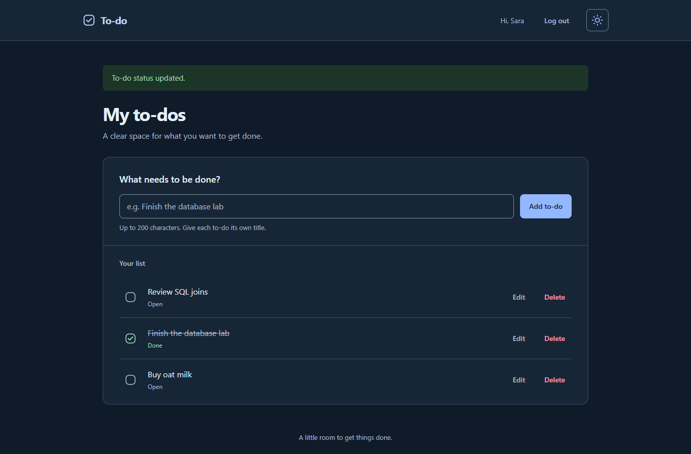
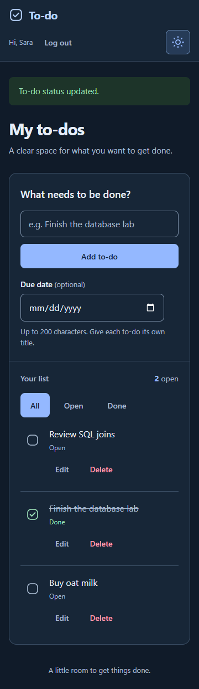

# Login and To-Do Application

This is our project for Database Lab 2 at Alexandria National University. Users can create an account, log in and manage their own to-do list. The database is called `registration`, and all database operations use plain SQL.

## Team

| Name | Student ID | Work |
| --- | --- | --- |
| Moustafa Mohamed | 2304252 | Project setup, accounts and authentication, password hashing, sessions, CSRF protection and shared integration. |
| Ibrahim Hossam | 2304248 | Personal to-do lists, adding/editing/deleting tasks, done/open status, task forms and validation, and handling oversized task IDs. |

Moustafa uses `moustafa-ash` on GitHub and Ibrahim uses `i949`. We both have commits in this repository.

## Technology

- **Back end:** Python and Flask. PyMySQL connects to MySQL, bcrypt hashes passwords, Flask-Session/cachelib handles sessions, and python-dotenv loads `.env`.
- **Front end:** HTML, Jinja templates, CSS and JavaScript.
- **Database:** MySQL, with `users` and `todos` tables.

The project was tested with Python 3.14.4 and MySQL 8.4.11 on Windows. [requirements.txt](requirements.txt) lists the Python packages. Node.js is only needed for the JavaScript tests.

## How to run

These steps are for Windows and PowerShell. Keep the terminal in the project folder when running the commands.

### 1. Install the tools

1. Install [Python 3.14](https://www.python.org/downloads/windows/) with pip and make sure `python` is available in the terminal.
2. Install [Git for Windows](https://git-scm.com/install/windows).
3. Install [MySQL Server 8.4](https://dev.mysql.com/doc/refman/8.4/en/windows-installation.html), including its required Visual C++ runtime. Run MySQL Configurator after installation. Use TCP/IP on port `3306`, set a root password, and apply the configuration to start the Windows service. Keep the username and password for the next steps.
4. Install [DBeaver Community](https://dbeaver.io/download/) to run the database script. DBeaver is a database client; MySQL Server must also be installed and running.

Reopen PowerShell after installation and check:

```powershell
python --version
git --version
```

### 2. Download the project and install the packages

```powershell
git clone https://github.com/moustafa-ash/-To-Do-Application.git
cd .\-To-Do-Application
python -m venv .venv
.\.venv\Scripts\python.exe -m pip install -r requirements.txt
```

The commands below use the virtual environment directly, so you don't need to activate it.

### 3. Create the database

**Running `database/schema.sql` deletes and recreates `registration`. Any existing accounts and tasks in that database will be lost. Run it for a new setup or when you want to reset the database.**

1. In DBeaver, choose **Database → New Database Connection → MySQL**.
2. Enter `localhost`, port `3306`, and your MySQL username and password. Leave the database field empty. A new local lab installation can use the `root` account set up earlier.
3. Click **Test Connection** and download the driver if DBeaver asks for it. Finish creating the connection.
4. Open `database/schema.sql` using **File → Open File**.
5. Select your MySQL connection for the editor. If the tab says `<none>`, choose the connection under **SQL Editor → Context**.
6. Clear any text selection, then choose **SQL Editor → Execute SQL script** to run the whole file.

To check the result, run this in a separate SQL editor:

```sql
SHOW TABLES FROM registration;
DESCRIBE registration.users;
DESCRIBE registration.todos;
```

You should see `users` and `todos`. The script contains no test accounts, so you'll register your own account through the website.

### 4. Set up `.env`

```powershell
Copy-Item .env.example .env
.\.venv\Scripts\python.exe -c "import secrets; print(secrets.token_hex(32))"
```

Open `.env` in a text editor. Enter your MySQL details and use the generated value for `SECRET_KEY`:

```dotenv
DB_HOST=localhost
DB_PORT=3306
DB_USER=your_mysql_username
DB_PASSWORD=your_mysql_password
DB_NAME=registration
SECRET_KEY=paste_your_generated_secret_here
```

If your password contains spaces or `#`, put quotes around it, for example `DB_PASSWORD='your password#here'`. Use the same MySQL account you tested in DBeaver, or one with permission to read and write the tables.

`.env` is ignored by Git. Each teammate needs their own copy. If you're updating an existing setup, keep your current `.env` instead of copying over it.

### 5. Start the server

Check the database connection first:

```powershell
.\.venv\Scripts\python.exe -c "from db import get_connection; connection = get_connection(); print('Connected to MySQL successfully'); connection.close()"
```

Then start Flask:

```powershell
.\.venv\Scripts\python.exe -m flask --app app run
```

### 6. Open the website

Open [http://127.0.0.1:5000/register](http://127.0.0.1:5000/register). Registering logs you in and opens your list. You can log out from the header and log back in at [http://127.0.0.1:5000/login](http://127.0.0.1:5000/login).

Keep the terminal running while using the site. Press **Ctrl+C** to stop it, and restart it after changing Python files or `.env`.

If the database connection fails, check the MySQL service, your `.env` details and whether the whole schema script ran. If port 5000 is already in use, start Flask with `--port 5001` and open the same address using port 5001. If a form becomes stale after logout or a restart, reopen the page and try again.

### If you already have a database

You don't need to reset it to get duplicate-title protection. Check for existing duplicates and the unique index:

```sql
SELECT user_id, title, COUNT(*) AS copies
FROM registration.todos
GROUP BY user_id, title
HAVING COUNT(*) > 1;
SHOW INDEX FROM registration.todos;
```

Rename any duplicates first. If `uq_todos_user_title` is missing, run [database/migrations/001_unique_todo_titles.sql](database/migrations/001_unique_todo_titles.sql) once. Skip this migration if you used the full schema, because it already creates the index.

## Features

| Requirement | What the app does |
| --- | --- |
| R1 | Register with name, email, password and confirmation. Duplicate email shows `Email Already Exists`. Successful registration logs the user in and opens the list. |
| R2 | Log in with email and password. Wrong password and unknown email both show `Invalid email or password`. Logout clears the session. |
| R3 | Redirect visitors to login. Logged-in users only see their own tasks, newest first. |
| R4 | Add a task. |
| R5 | Edit a task's title. |
| R6 | Mark a task done or open. Done tasks have a check mark, a crossed-out title and a `Done` label. |
| R7 | Delete a task after confirmation. With JavaScript disabled, the app shows a confirmation row with Delete and Cancel buttons. |
| R8 | Validate forms in JavaScript and again on the server. Invalid input shows messages on the same page without saving changes. |
| R9 | Store bcrypt password hashes, use SQL parameters, and take the user ID from the server-side session. UPDATE and DELETE also check task ownership. |
| R10 | Use the same styling across pages, support phone-sized screens, and show errors, success messages, an empty-list message, the user's name and logout. Invalid links and failed requests have styled error pages. |

The validation messages match the assignment: `Name is required`, `Email is required`, `Password is required`, `Confirm password is required`, `Passwords do not match`, `Title is required` and `Title is too long`.

Titles can contain up to 200 characters, including emojis. Empty or space-only titles are rejected. Passwords are limited to 72 UTF-8 bytes because of bcrypt. Write forms also include CSRF tokens.

The app prevents duplicate titles in the same user's list. Another user can use the same title. With the fresh schema, capitalization doesn't make a title different, and a done task still keeps its title.

### Bonus

We added **dark mode** and **automated tests**. The assignment caps the bonus at +1.

Click the moon in light mode to switch to dark mode, or the sun to switch back. Your browser remembers the choice. With JavaScript disabled, the site stays in light mode. If local storage is blocked, the switch still works on the current page but the choice isn't saved.

## Screenshots

The screenshots use demonstration accounts in a temporary database.

### Register page with error messages


### Login page


### List with some tasks, including one done


### Phone-sized window, 360 px wide


### Dark mode





## Assignment questions

### (a) Why do UPDATE and DELETE include `AND user_id = ?`? What happens if we remove it?

To make sure the user is editing or deleting their own task. It prevents them from changing other users' tasks even if they know their IDs. Without it, someone could edit or delete another user's task by sending its ID. The user ID comes from the session, not the form. In PyMySQL, the placeholder is `%s` instead of `?`.

### (b) What happens if we insert a task for a user ID that doesn't exist? Which constraint is this?

MySQL rejects it because `user_id` is a foreign key referencing `users.user_id`. A to-do must belong to a user who exists in the users table. This is the referential integrity constraint.

### (c) Why do we store a hash instead of the password?

To avoid exposing users' passwords if the database is leaked. We store a salted bcrypt hash and compare the entered password with that hash during login.

### (d) Why check for an empty name when the column is `NOT NULL`?

`NOT NULL` only checks for null values. An empty string isn't null, so we still need our own check for empty strings. The app also trims spaces before checking the name.

## Tests

The database tests use a temporary `registration_verify_*` database and remove it afterward. Your MySQL account needs permission to create and drop databases for these tests. They don't reset the normal `registration` database.

```powershell
.\.venv\Scripts\python.exe -X utf8 -B tests/integration.py
```

For the JavaScript checks, install Node.js and run:

```powershell
node tests/auth_validation.test.js
node tests/todos_validation.test.js
node tests/theme.test.js
```

The optional browser tests need Node.js, Google Chrome and Playwright:

```powershell
npm install --prefix "$env:TEMP\todo-browser-checks" --no-package-lock playwright
$env:NODE_PATH = "$env:TEMP\todo-browser-checks\node_modules"
.\.venv\Scripts\python.exe -X utf8 -B tests/browser.py
```

These check registration, login/logout, task changes, two-user privacy, validation, CSRF, deletion confirmation, both themes and responsive layouts. The browser runner also refreshes the screenshots. Database tests, JavaScript checks and Chrome checks passed on 8 October 2026. Dependency installation was checked in a fresh virtual environment; installing the tools on a completely blank Windows machine wasn't repeated.

This is a local lab app. Restarting Flask clears the in-memory login sessions. Email input checks the format in the browser, but the app doesn't verify that the user owns the email address.
